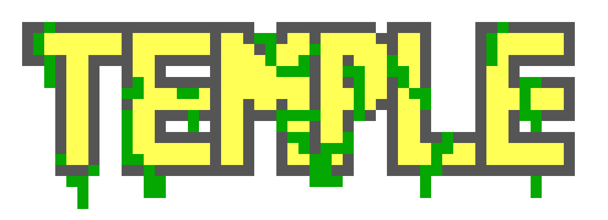

<p align="center">
	
	<p align="center">A virtual machine written in C</p>
</p>
<p align="center">
	<a href="./LICENSE">
		
	</a>
	<a href="https://github.com/Temple-VM/temple/issues">
		
	</a>
	<a href="https://github.com/Temple-VM/temple/pulls">
		
	</a>
	<br><br><br>
</p>

## Table of contents
* [Introduction](#introduction)
* [Quickstart](#quickstart)
* [Write a program](#write-a-program)
* [Milestones](#milestones)
* [Documentation](#documentation)
* [Bugs](#bugs)
* [Dependencies](#dependencies)
* [Make](#make)

## Introduction
> NOTE: This VM is not in any way related to TempleOS

A virtual machine written in C. [I previously wrote one with the same name in C++](https://github.com/lordoftrident/temple_lang),
but it was very bad so i decided to make a new one.

## Quickstart
```sh
$ make
$ make install
$ temple
```

## Write a program
Since you probably do not want to write programs in binary (i know i do not), you can install the
[Temple Assembler](https://github.com/Temple-VM/tmasm) to write and compile Temple programs.
Everything is explained in that repository.

## Milestones
- [X] Basic instructions (move, push, add, sub)
- [X] Conditions
- [X] Console output
- [X] Data segment
- [ ] Custom file descriptors system (file I/O)
- [ ] Loading in shared libraries

## Documentation
Coming soon.

## Bugs
If you find any bugs, please create an issue and report them.

## Dependencies
- A unix system

## Make
Run `make all` to see all the make rules.
